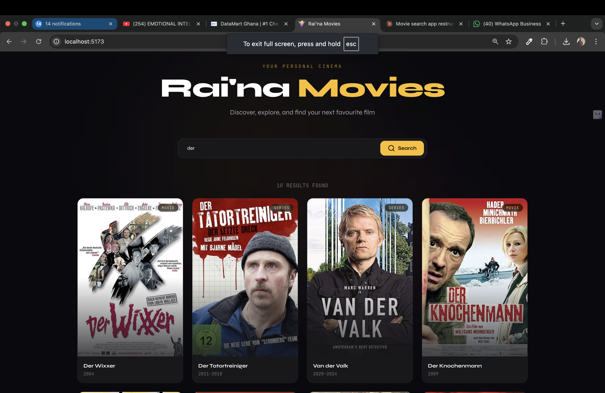

# 🎬 Rai'na Movies

A sleek, fast movie search app built with **React**, **Vite**, and **Tailwind CSS** — powered by the [OMDb API](https://www.omdbapi.com/). Search millions of films, series, and episodes with a clean, cinema-inspired UI.



---

## ✨ Features

- 🔍 **Instant movie search** via the OMDb API
- 🎨 **Dark cinema aesthetic** with amber accents and smooth hover effects
- 📱 **Fully responsive** — mobile, tablet, and desktop
- ⚡ **Vite-powered** for lightning-fast builds and HMR in development
- 🐳 **Dockerized** with a multi-stage build for lean production images
- 🧱 **Clean architecture** — hooks, services, and components are properly separated
- 🔗 **IMDB links** — each card links directly to the film's IMDB page

---

## 🗂 Project Structure

```
raina-movies/
├── public/
│   └── favicon.svg
├── src/
│   ├── components/
│   │   ├── EmptyState.jsx     # Shown when no results are found
│   │   ├── Footer.jsx         # Site footer with credits
│   │   ├── Loader.jsx         # Animated loading spinner
│   │   ├── MovieCard.jsx      # Individual movie result card
│   │   └── SearchBar.jsx      # Controlled search input + button
│   ├── hooks/
│   │   └── useMovieSearch.js  # Encapsulates search state & logic
│   ├── services/
│   │   └── movieService.js    # OMDb API calls (fetch layer)
│   ├── App.jsx                # Root component & layout
│   ├── index.css              # Tailwind directives + Google Fonts
│   └── main.jsx               # React DOM entry point
├── .env.example               # Environment variable template
├── .gitignore
├── Dockerfile                 # Multi-stage production build
├── docker-compose.yml         # Dev + production services
├── nginx.conf                 # SPA routing + caching config
├── package.json
├── postcss.config.js
├── tailwind.config.js
└── vite.config.js
```

---

## 🚀 Getting Started

### Prerequisites

- [Node.js](https://nodejs.org/) v18+
- An OMDb API key — free at [omdbapi.com/apikey.aspx](https://www.omdbapi.com/apikey.aspx)

### 1. Clone & install

```bash
git clone https://github.com/yourusername/raina-movies.git
cd raina-movies
npm install
```

### 2. Set up environment variables

```bash
cp .env.example .env
```

Open `.env` and add your key:

```env
VITE_OMDB_API_KEY=your_api_key_here
```

### 3. Run in development

```bash
npm run dev
```

App is live at **http://localhost:5173**

### 4. Build for production

```bash
npm run build
npm run preview   # Preview the production build locally
```

---

## 🐳 Docker

### Production (nginx, port 8080)

```bash
# Build and run
VITE_OMDB_API_KEY=your_key docker compose up --build

# Or pass the key from your .env file
docker compose up --build
```

App is served at **http://localhost:8080**

### Development with hot reload

```bash
docker compose --profile dev up raina-movies-dev
```

Hot-reloading dev server at **http://localhost:5173**

---

## 🛠 Tech Stack

| Technology | Purpose |
|---|---|
| [React 18](https://react.dev/) | UI library |
| [Vite](https://vitejs.dev/) | Build tool & dev server |
| [Tailwind CSS](https://tailwindcss.com/) | Utility-first styling |
| [OMDb API](https://www.omdbapi.com/) | Movie data |
| [Docker](https://www.docker.com/) | Containerisation |
| [nginx](https://nginx.org/) | Production static file server |

---

## 🔧 Available Scripts

| Script | Description |
|---|---|
| `npm run dev` | Start development server with HMR |
| `npm run build` | Build optimised production bundle |
| `npm run preview` | Preview production build locally |
| `npm run lint` | Run ESLint across the project |

---

## 🌍 Environment Variables

| Variable | Required | Description |
|---|---|---|
| `VITE_OMDB_API_KEY` | ✅ | Your OMDb API key |

> **Note:** All Vite environment variables must be prefixed with `VITE_` to be accessible in the browser bundle.

---

## 📄 License

MIT — feel free to use, fork, and build on this project.

---

## 👤 Author

**AgyemangDev**

- 🔗 [linktr.ee/agyemang166](https://linktr.ee/agyemang166)

---

<p align="center">Made with ❤️ and too many late-night movie searches</p>